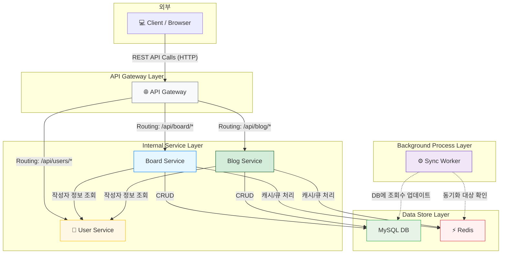

```mermaid
graph TD
    subgraph "외부"
        Client[💻 Client / Browser]
    end

    subgraph "API Gateway Layer"
        style Gateway fill:#f8f9fa,stroke:#6c757d
        Gateway["🌐 API Gateway"]
    end

    subgraph "Internal Service Layer"
        style BoardService fill:#e6f7ff,stroke:#007bff
        style BlogService fill:#d4edda,stroke:#155724
        style UserService fill:#fff7e6,stroke:#ffc107
        BoardService["Board Service"]
        BlogService["Blog Service"]
        UserService["👤 User Service"]
    end

    subgraph "Data Store Layer"
        style DB fill:#e6f3e6,stroke:#28a745
        style Redis fill:#fff0f1,stroke:#dc3545
        DB["MySQL DB"]
        Redis["⚡ Redis"]
    end
    
    subgraph "Background Process Layer"
        style SyncWorker fill:#f0e6f7,stroke:#6f42c1
        SyncWorker["⚙️ Sync Worker"]
    end

    Client -- "REST API Calls (HTTP)" --> Gateway

    Gateway -- "Routing: /api/board/*" --> BoardService
    Gateway -- "Routing: /api/blog/*" --> BlogService
    Gateway -- "Routing: /api/users/*" --> UserService
    
    BoardService -- "작성자 정보 조회" --> UserService
    BlogService -- "작성자 정보 조회" --> UserService

    BoardService -- CRUD --> DB
    BlogService -- CRUD --> DB

    BoardService -- "캐시/큐 처리" --> Redis
    BlogService -- "캐시/큐 처리" --> Redis

    SyncWorker -. "동기화 대상 확인" .-> Redis
    SyncWorker -. "DB에 조회수 업데이트" .-> DB
```
